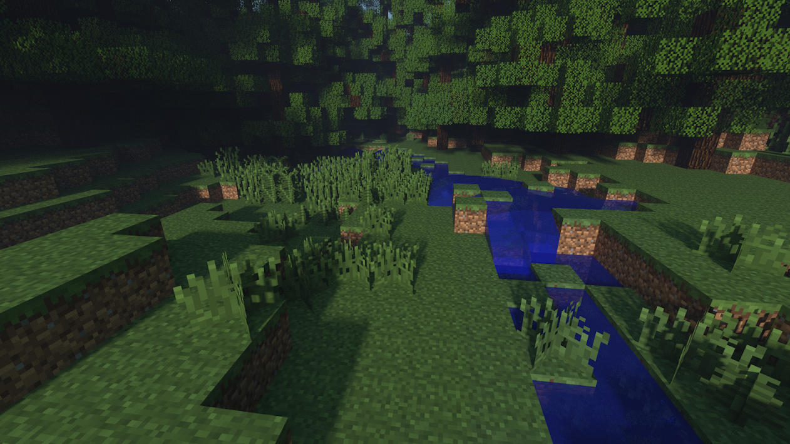

# Whitebox-tutorial
A guide for dummies by William Liberg

Reproducibility is a major principle of the scientific method and it is even more important for AI methods. Google colab is a good way to colaborate and share reproducable examples of working code. Whitebox-tools is avalible as python package https://pypi.org/project/whitebox/ which makes it possible to run on google colab. This tutorial demonstrates how to extract streams and watersheds from high resolution digital elevation models

## Click this button to get started

WhiteboxTools: https://github.com/jblindsay/whitebox-tools

PyPI: https://pypi.org/project/whitebox/

Contact: William.lidberg@slu.se
